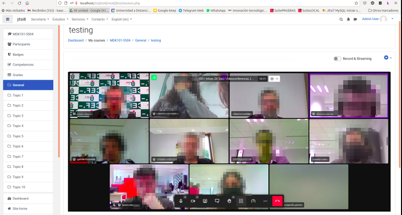
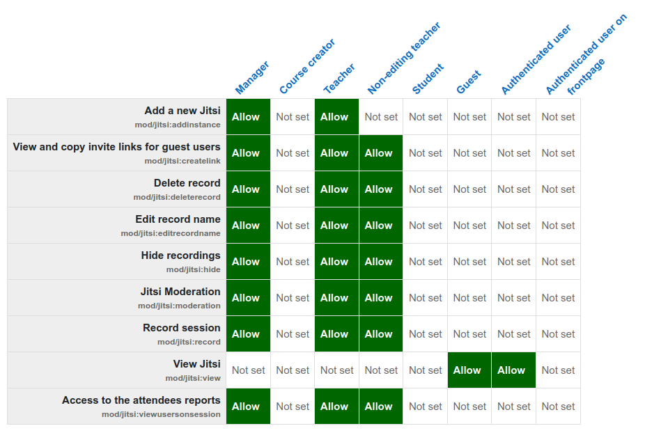
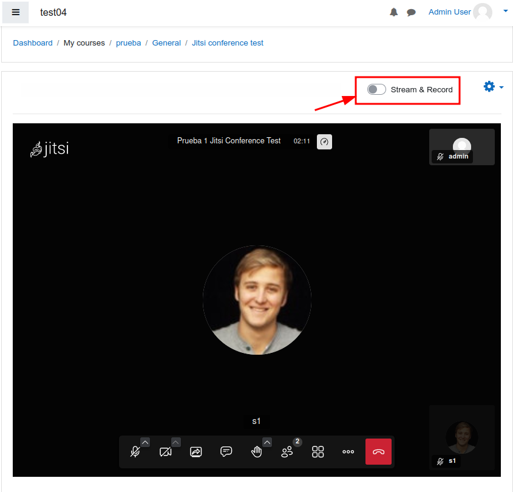
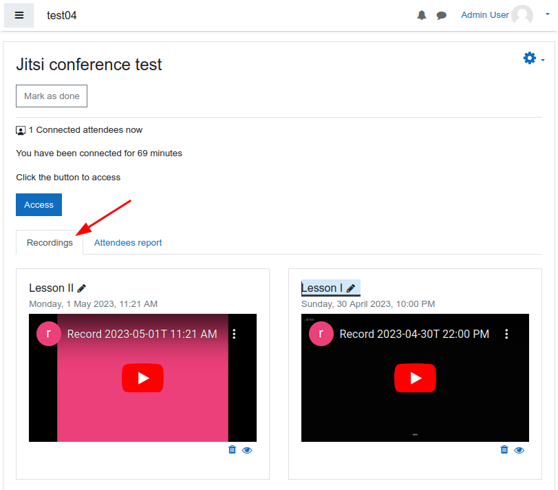

# Jitsi Meet moodle plugin
This plugin (**mod_jitsi**) allows teachers **create webconference activities** fully integrated **with Jitsi Meet Servers**.

**Jitsi Meet** is an open-source videoconferencing solution that enables you to easily build and implement secure video conferencing. If you don't know about Jitsi Meet you can try it at https://meet.jit.si/. Many commercial web conference services are deployed using Jitsi Meet because it is extremely scalable. More information about Jitsi can be found at https://jitsi.org/

**Out of the box the plugin works** using the public Jitsi Meet Servers (meet.jit.si). **It's free** and that's the best way to test if this plugin satisfies you. Most of the features in this plugin are available using the public server but probably you'll be restricted to 5 minutes per conference (read more below).

Stop reading here... try the plugin now in your test Moodle environment and return later to continue reading.

Glad to see you here again. These are some of the Jitsi features inside Moodle you was able to try:

* Schedule webconferences in your course
* Attendees report accounting minutes
* Activity completion tracking (conditions related with time attendance)
* Unlimited participants (limits are imposed mainly by bandwidth in your Jitsi servers)
* Moodle profile pictures used as avatar in webconference
* Guest URLs for users in other courses or out of Moodle
* HD Audio Video
* Multiple participants can share their screen simultaneusly
* Tile view
* Break out rooms
* Chat with emojis
* Polls
* Virtual Backgrounds
* YouTube video sharing... pause, rewind and comment videos with all your students (cool)
* Full moderation control in order to silence or kickoff students (token based mode recomended... see below)
* YouTube streaming and **automatic recordings publishing** in your course...  really cool (requires the streaming configuration... see below)
* and others...

## Permissions

These are the permissions populated by default with the plugin.

Most of them are available at the activity level so a teachers can override some default restrictions.

- **Add a new Jitsi** (mod/jitsi:addinstance): allow to create Jitsi activities.
- **View and copy invite links for guest users** (mod/jitsi:createlink): a teacher could allow students to share the invitation links for guest users.
- **Delete record** (mod/jitsi:deleterecord): allow to mark a recording as deleted. The recording will be set as private in YouTube.  Recordings marked as deleted will be deleted in YouTube with the scheduled task (\mod_jitsi\task\cron_task_delete) or by the admin from a list. You may want to prevent non-editing teachers from deleting recordings.
- **Edit record name** (mod/jitsi:editrecordname): allow to rename the title in a recording. You may want to prevent non-editing teachers from renaming recordings.
- **Hide recordings** (mod/jitsi:hide): allow to hide recordings. You may want to prevent non-editing teachers from hiding recordings.
- **Jitsi Moderation** (mod/jitsi:moderation): determine who is moderator in sessions. When "Token configuration" is set only users with this rol are promoted as Jitsi moderators and this icon is displayed with these users. When "Token configuration" is missing some buttons and features like "mute-everyone" or "kick off participant" are hidden to non moderator user but you must be careful because we are not able to hide all moderation options in scenarios without token configuration and experienced users may be able to bypass these restrictions.
- **Record session** (mod/jitsi:record): allow to start recordings. You could create Jitsi Sessions where students could record themselves.
- **View Jitsi** (mod/jitsi:view): set the users who can see and access Jitsi activities in the course view.
- **Access to the attendees reports** (mod/jitsi:viewuseronsession): you may want to allow students from access to attendees reports.

## Streaming configuration

"Out of the box" teachers can stream and record sessions using their own YouTube accounts. They just need to create a "Go Live" streaming in YouTube and copy the "stream key"  in the "Start  live stream" Jitsi interface and later the teacher can publish the link to the recording in his YouTube channel. That's easy but maybe your teachers haven't YouTube accounts or these are not allowed to stream (YouTube must approve this feature).

For a better experience you can configure the plugin to stream and record in corporate YouTube accounts that previously you prepare to work in that way and your teachers just need to click in the "Record and Streaming" switch.

With this advance configuration, recordings will be automatically published to students and teacher can edit the title of every recording. One Jitsi activity can have many recordings.

Recordings will remain on "unlisted" mode in the YouTube accounts so nobody will find them searching in YouTube but there is no way to stop your students from posting the url somewhere unwanted. Your teachers should be warned about it.

Teachers can hide or deleted the recordings in the Jitsi activities but only administrators can order to completely delete the recording in YouTube. This is because backup and restore tasks with user data could cause a recording to be available in different courses (or different Moodle environments). Now an scheduled task is configured by default in order to  remove recordings in YouTube. You can set the retention period for this automatic deletion task.

All the magic works using **YouTube v3 APIs** in order to:

- create live streaming sessions on the fly
- set recordings with "embed" properties to display inside Moodle
- delete recordings when they are no longer needed

So you need to configure your own OAuth 2.0 Client IDs in the Google Cloud Platform and connect one or more YouTube accounts. 

Only ONE YouTube account can be set as "in use", and all the streamings in your Moodle will be saved there. 

Why it's allowed to set up several YouTube accounts? YouTube is unpredictable and we don't know if in the future they could establish quotas for "unlisted" videos or if in some moment they decide to restrict your Live Stream permission caused for reputation problems in some teacher recording (a teacher doesn't should stream Rolling Stones concerts). If  this happens, it is a good idea to have some extra accounts set up... just in case.

### Set up your OAuth 2.0 Client ID in Google Cloud

We recommend to use different Google accounts for your OAuth2 client and for your YouTube accounts. If you are just testing you can use the same account.

On few steps... you must

- prepare one or two YouTube accounts with live streaming features enabled (requires register a phone and wait for 24 hours)
- create a new project in Google Console (https://console.cloud.google.com)
- access to "APIs and services" and enable "youtube data api v3"
- create OAuth2 credentials for a "Web application" adding the "Authorized redirect URIs" you will find in the Jitsi configuration plugin in the "OAuth2 id" instructions... (something like this **`https://your_moodle_domain/mod/jitsi/auth.php`** )
- add your YouTube accounts as "Test users" in the "OAuth2 consent screen"
- Copy "Your Client ID" and "Your Client Secret" to Jitsi config in Moodle
- In Moodle add and authorize your Streaming/Recording Accounts (YouTube accounts)
- In Moodle enable "Live stream" and select "Moodle Integrated" as "Live Streaming Method"

At this moment you have set up an EXTERNAL app in "Testing" and now you can try if everything is working as expected.

We have recorded a screencast with the "how to":

https://youtu.be/BFHMsQYDprA

You should consider to get the status of "Publish App"  because in "Testing", authorizations expire in 7 days and the integrated switch to start recordings will disappear. In that case, as an administrator you should re-authorize your  Streaming/Recording YouTube account. You should read about the limitations when "Testing" status. https://support.google.com/cloud/answer/10311615#publishing-status&zippy=%2Ctesting.

**IMPORTANT**: if your institution has **Google Workspace the "User type" in the "OAuth consent screen" can be "INTERNAL"**. In this way, none "Test users" are required to be added and tokens will never expire. **Probably that's the easiest and fastest way to set up this and you don't need to request the "Publish App"**.

**WARNING**: the credentials should never been deleted in the Google console because all the recordings done will be removed in all the YouTube accounts.

## Token based mode

If you decide to deploy this plugin in production you may would like to install your private Jitsi Meet server with "Token based" mode. This configuration will give you extra control with the moderation privileges.

Jitsi Meet deployment servers can be complex and is beyond the scope of this article but you can review our ansible playbook ([ansible-jitsi-meet](https://github.com/udima-university/ansible-jitsi-meet)).

Alternatively you could explore on buying Jitsi Meet as a service with some provider (ie: https://jaas.8x8.vc) with an important discount for Moodle users (read more below).

Many Governmental Education Institutions deploy their own Jitsi servers to be used by their schools or universities... you could ask them if they provide Jitsi token credentials for this configuration.

Basically the token configuration send your teachers (or roles with the mod/jitsi:moderation enabled) as moderators in a Jitsi session in a secure mode and only they are allowed to mute participants, disable cameras or kick-off participants.

## Recommendations when using public Jitsi servers

As we said "out of the box", the plugin connects with the public servers at meet.jit.si but there many other public Jitsi Meet servers... just make some search with Google or look at the [Community-run instances list](https://jitsi.github.io/handbook/docs/community/community-instances/).  You should test other servers in order to be able change in case of a disruption service or maybe because you find a public server nearest to your users and with less latency.

## Important announcement from meet.jit.si team

The **meet.jit.si** team recently announced that the embed mode, required by our plugin, **is now restricted and they only allow to use it for 5 minutes on every conference**, but this is enough in order to test if this fits to you. You can [read about this announcement here](https://community.jitsi.org/t/important-embedding-meet-jit-si-in-your-web-app-will-no-longer-be-supported-please-use-jaas/). We would like to thank them for providing such a good service for so many years without restrictions, which helped many schools to continue their activities during the Covid pandemic.

 **Jitsi is Open Source** and you can **install your own Jitsi Server** or to **rent the service from https://jaas.8x8.vc/** with an **important discount for you**. Probably you could find other unofficial sites providing professional hosting for Jitsi, but 8x8 is the company which supports the Jitsi project and buying their services is the best way to support the project in order to guarantee it's future.

## Discount from 8x8 on Jitsi as a Service (jaas)

If you decide to rent Jitsi as service from https://jaas.8x8.vc/ you can use the coupon **MOODLE23** in order to get an **80% discount for three months on the three JaaS packages**. This means,  for your first three months, you can have up to 300 users for $20/month, 1500 users for $100/month and 3000 users for $200/month.

## Disclaimer

This plugin is maintained by UDIMA University (www.udima.es) and is not related or partner with 8x8 Inc nor with "Jitsi as a service" (jaas).

